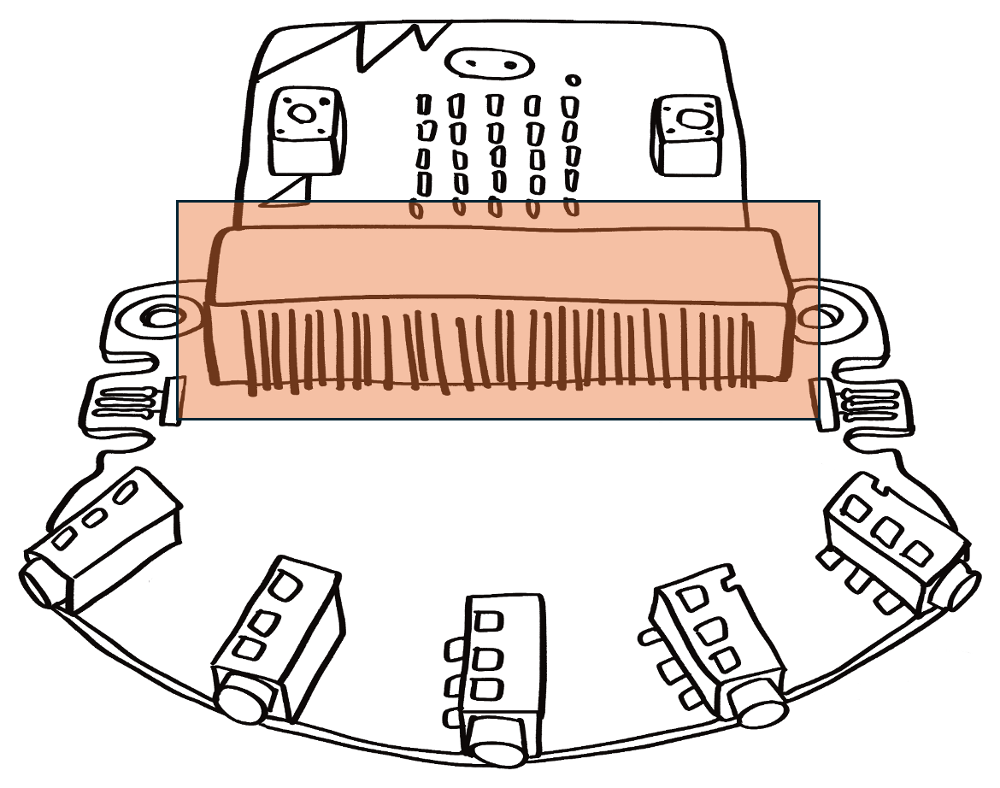
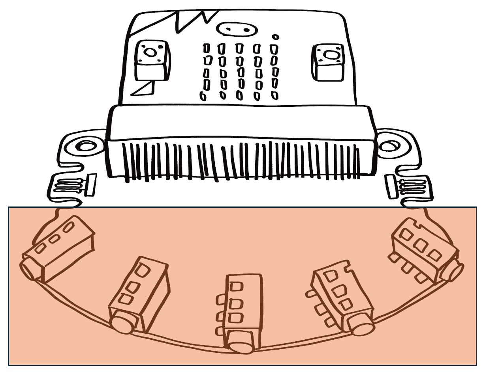
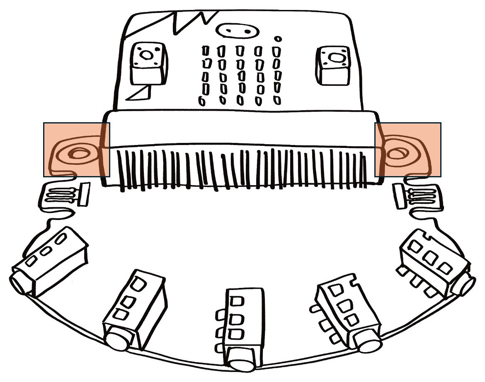
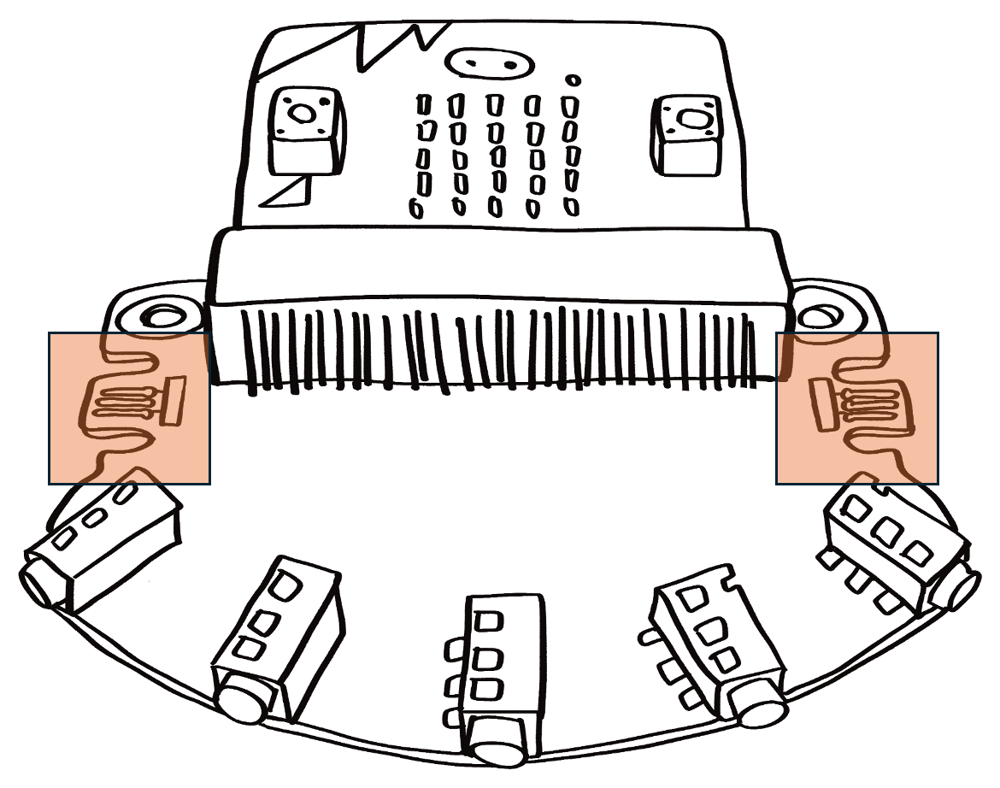
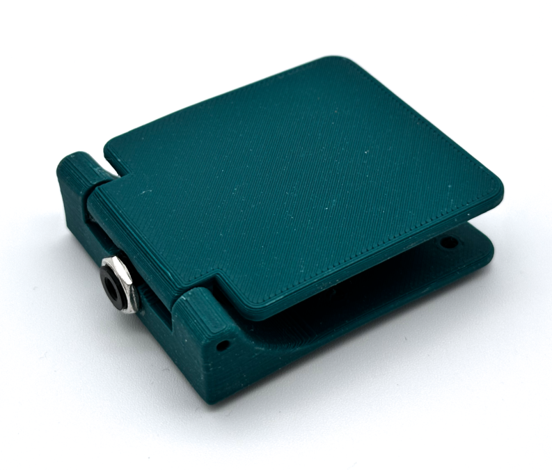

# Overview

<figure>
    
    <caption>Test</caption>
</figure>

The Access:bit is a custom hardware extension for the BBC micro:bit designed to improve accessibility and make physical interaction easier for learners with different mobility needs. It was created following accessibility research and feedback from educators, with the aim of bringing common adaptive controls (such as large switches and alternative interface hardware) straight to the micro:bit without complex wiring or code changes. The board makes it simple to connect adaptive input devices, map them to micro:bit pins and buttons, and mount everything securely in place.

## Microbit Connection

<figure>
    
</figure>

The Access:bit features a dedicated edge connector socket that accepts a standard micro:bit board. This direct connection routes the micro:bit’s button circuits as well as general-purpose I/O pins (P0, P1, P2) out to external connectors. The idea is to let adaptive switches and other inputs talk directly to the micro:bit without requiring soldering or fragile jumper wires.

## Jack Connections

<figure>
    
</figure>

Adaptive input devices — including large “assistive switches” — commonly use 3.5 mm audio jacks as their interface. The Access:bit breaks out multiple jack sockets on the PCB, each tied to a specific micro:bit function (such as button A or B, and other GPIO pins). The board also includes port labels and even LED indicators in some revisions so users can clearly see the activity on each connection.

## Mounting Holes

<figure>
    
</figure>

Recognising that accessibility setups often need to be stable and long-lasting, the board includes mounting holes so it can be fixed into an enclosure, desk panel, or educational kit. This makes the hardware more robust and less prone to shift or disconnect during use — a valuable feature when working with learners who depend on consistent physical interfaces.

## Jacdac Ports (Advanced!)

<figure>
    
</figure>

An advanced addition to later revisions of the board is support for Jacdac — a plug-and-play peripheral protocol originally developed to simplify sensor/actuator connections on microcontrollers. The Access:bit borrows circuitry from other micro:bit addons to include Jacdac ports, giving makers and advanced users the ability to expand the board with modular Jacdac devices, broadening what kinds of inputs and outputs can be used without more wiring.

# Extra - 3D Printable Switches

Although the Access:bit itself provides the electrical and mechanical breakout, many users pair it with 3D-printed switches and housings. John Vidler tested his board with his own 3D printed switch designs (e.g., paddle switches) to ensure the jack ports work reliably with custom-shaped large-button interfaces.

<figure>
    
</figure>

Because adaptive switches can vary widely in shape and operation, being able to design and print bespoke switch housings means educators and makers can build physical controls that suit a learner’s specific needs — whether that’s a large press-pad, a sip-and-puff style actuator, or something entirely custom.